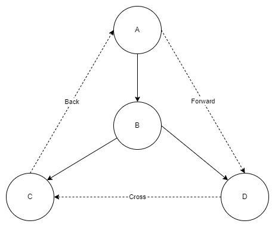

# Week 3: Graphs Part 1

- [Home](/README.md#async-table-of-contents)
- [3.1 Weekly Introductoin](#31-weekly-introduction)
- [3.2 Graphs](#32-graphs)
- [3.3 Depth-First Search (DFS)](#33-depth-first-search-dfs))
- [3.4 Directed Acyclic Graphs (DAGs)](#34-directed-acyclic-graphs)
- [Week 3 Live Session](#week-3-live-session)

# 3.1 Weekly Introduction
([top](#week-3-graphs-part-1))

- Introduction to graphs, including discussion of how to represent graphs on a computer
- Basic graph terminology
- Depth-first search, an algorithm for exploring graphs
- Directed acyclic graphs

# 3.2 Graphs
([top](#week-3-graphs-part-1))

## Graphs
- Graph data structure
  1. **Nodes/vertices**
     - Let $V={v_1,v_2,...}$
  2. **Edges/links**
     - let $E={e_1,e_2,...}$
     - an edge is usually written as $(v_1,v_2)$ where $v_1$ and $v_2$ are vertices
- can be weighted: different edges have different strengths
- can be directed: edges point in one direction

## Graph Representation
- Adjacency Matrix:
  - suppose there are $n=|V|$
  - create an $nxn$ matrix $A$

### Exercise 3.2.2
*Daniel Shannon*
> How much space does the adjacency matrix take?

The adjacency matrix takes $n^2$ space, where $n$ is the number of nodes.

## Terminology
- two *nodes* are **adjacent** if they are connected by an edge.
- two *edges* are **adjacent** if thy have one vertex in common.
- a **path** is a sequence of adjacent edges froma vertex *v* to another vertex *u*.
- a **component** is a set of vertices such that there exists a path between every pair of vertices in the set.

## 3.3 Depth-First Search (DFS)
([top](#week-3-graphs-part-1))

>```
>procedure explore(G,v)
>Input:  G(V,E) is a graph; v is in V
>Output: visited(u) is set to true for all nodes u reachable from v
>previsit(v)
>visisted(v)=true
>for each edge (v,u) in E:
>  if not visited(u): explore(u)
>postvisit(v)
>```
>
>```
>procedure previsit(v)
>pre[v]=clock
>clock=clock+1
>```
>```
>procedure postvisit(v)
>post[v]=clock
>clock=clock+1
>```
> 

### More Terminology
- A **cycle** is a path with at least two edges from a node *u* back to itself.
- A **tree** is a graph without cycles.
- A **back edge** is an edge leading from a later node leading to a node from *earlier* in the search.

### DFS on Directed Graphs
- we can run DFS on directed graphs, making sure to only follow edges in their correct direction.



- A is the **root**
- B is the **child** of A
- B is the **parent** of C
- A is an **ancestor** of D

## 3.4 Directed Acyclic Graphs
([top](#week-3-graphs-part-1))

 A DAG is a directed graph without any cycles.
 - How can we tell that a graph is a DAG?
   - Do a DFS and look for the presence of back edges.

- what good are DAGs?
- Used to model situations with constraints

### DAG Terminology
- a **source** is a node with no incoming edges
- a **sink** is a node with no outgoing edges
- a **linearization** is a sorting of the nodes so that every edge goes from an early node to a later node.

*every DAG can be linearized*

### Strongly connected component
- A **strongly connected component** in a directed graph is a set of nodes such that there is a (directed) path between every pair in *both* directions!

*Every directed graph is a DAG of its SCCs!*

### How do we find strongly connected components?
1. If the `explore` procedure is called on a node in a sink SCC, hen the set of nodes visited is exactly that SCC.

2. The node with the highest post value in a DFS lies in a source SCC.

3. If `C` and `C'` are SCCs, and there is an edge from a node in `C` to a node in `C'`, then the highest post number in `C` is higher than the highest post number in `C'`

How do we find SCCs?
- Idea:
  - Find a node in a sink SCC
  - Run explore from that node: the visited nodes are the SCC itself
  - Remove the sink SCC from the graph, find a new sink, and repeat
- But how do we find the SCCs
- Key Idea:
  - Reverse the directions on the graph; find a source SCC in the reversed graph!
  